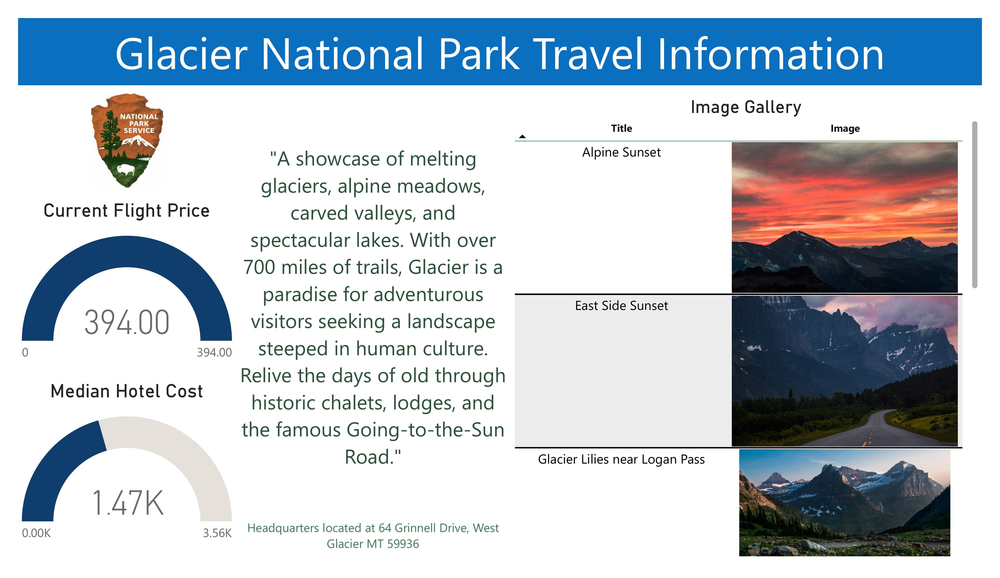
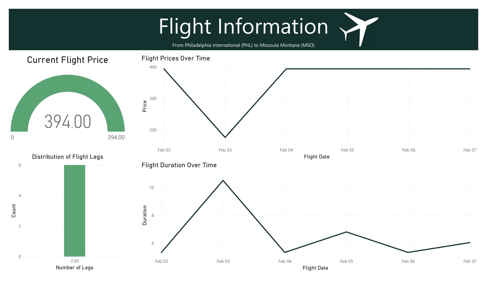
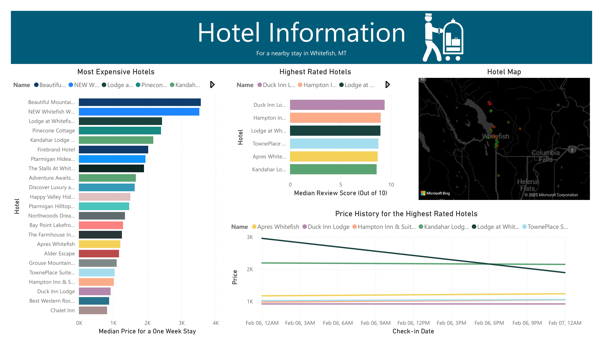

<h1 align="center">Glacier National Park Travel Data Pipeline</h1>

## Overview
This repository contains a personal project that I built to enhance my Data Engineering skills. The end goal is to create a robust ETL pipeline from a variety of data sources that culminates in an insightful dashboard.

## Current Tasks
As of this moment, I am currently working on adding data quality checks to my pipeline.

## Tools used
This project incorporates: Airflow (using Astronomer), AWS S3, Snowflake, and the dashboard is built with PowerBI. SQL, Pandas, and Polars are also all used.

## Data Sources
For this project, I used data from the ["Booking COM" API](https://rapidapi.com/DataCrawler/api/booking-com15) and the [National Park Service API](https://www.nps.gov/subjects/developer/index.htm).

## Flight Information

## Hotel Information

